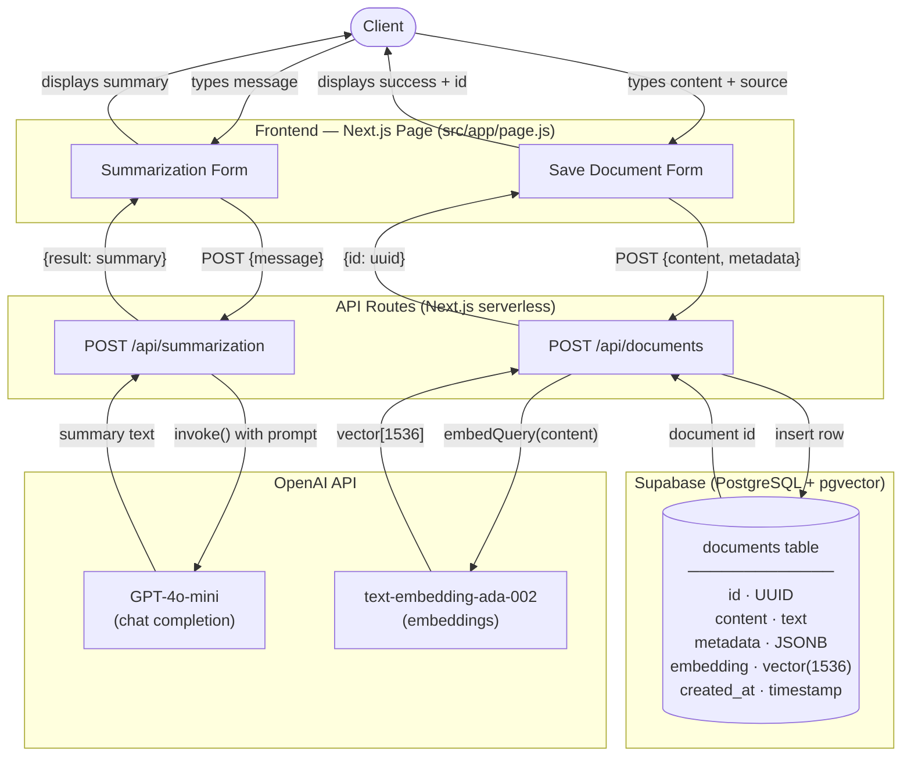

# RAG w/Langchain - Summarization app


# Vector DB App

A Next.js application for embedding documents into a vector database and summarizing text using OpenAI models.

## Features

- **Text Summarization** — Summarize any text using GPT-4o-mini via a live demo UI or REST API
- **Document Embedding** — Embed documents with OpenAI and store them in Supabase (pgvector) for future similarity search

## Architecture



## Data Flow Summary

| Flow | Input | Processing | Output |
|------|-------|------------|--------|
| Summarization | User text | GPT-4o-mini via LangChain | Summary string |
| Document Save | Text + optional source | OpenAI embedding → Supabase insert | Document UUID |

## Tech Stack

| Layer | Technology |
|-------|-----------|
| Framework | Next.js + React 19 |
| Styling | Tailwind CSS v4 |
| LLM | OpenAI GPT-4o-mini |
| Embeddings | OpenAI text-embedding-ada-002 |
| Abstraction | LangChain OpenAI |
| Database | Supabase (PostgreSQL + pgvector) |

## Getting Started

1. Copy `.env.local.example` to `.env.local` and fill in your keys:
   ```
   OPENAI_API_KEY=...
   NEXT_PUBLIC_SUPABASE_URL=...
   NEXT_PUBLIC_SUPABASE_ANON_KEY=...
   ```

2. Install dependencies:
   ```bash
   npm install
   ```

3. Run the dev server:
   ```bash
   npm run dev
   ```

4. Open [http://localhost:3000](http://localhost:3000)

## API Reference

### `POST /api/summarization`
```json
// Request
{ "message": "Text to summarize" }

// Response
{ "result": "Summarized text..." }
```

### `POST /api/documents`
```json
// Request
{ "content": "Document text", "metadata": { "source": "optional-source" } }

// Response
{ "id": "uuid-of-stored-document" }
```
